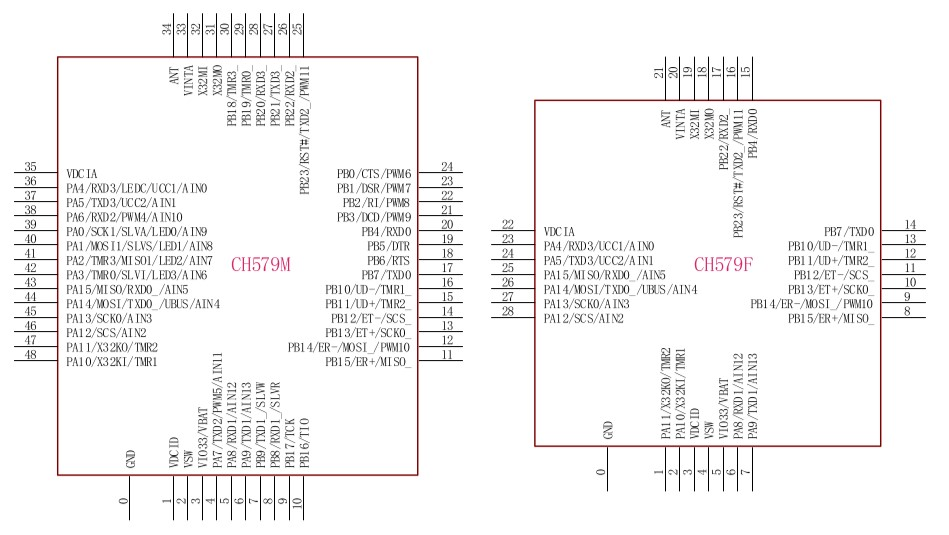

# [CH579](https://github.com/sochub/CH579)

 

#### [Vendor](https://github.com/sochub/Vendor)：[WCH](https://github.com/sochub/WCH)
#### [STM8](https://github.com/sochub/STM8)：[Cortex M0](https://github.com/sochub/CM0) 
#### [Level](https://github.com/sochub/Level)：40MHz 

## [CH579描述](https://github.com/sochub/CH579/wiki) 

[CH579](https://github.com/sochub/CH579) 采用 Cortex M0内核，片上集成低功耗蓝牙BLE(4.2)/Zigbee通讯模块、以太网控制器及收发器、全速USB主机和设备控制器及收发器、段式LCD驱动模块、ADC、触摸按键检测模块、RTC等丰富的外设资源。

 

### 关键参数：

* Cortex-M0内核，40MHz主频
* 32K SRAM，250KB，2KB DataFlash, 4KB BootLoader，支持ICP、ISP、IAP、OTA
* 双模：BLE兼容4.2规范，Zigbee兼容IEEE 802.15.4规范，单端RF接口无需外部电感
* 支持3.3V和2.5V电源，范围2.1V～3.6V, 内置DC/DC转换，0dBm发送功率时电流6mA
* 多种低功耗模式：Idle，Halt，Sleep，Shutdown，内置电池电压低压监控，最低电流0.2uA
* 提供10M以太网接口，内置PHY
* 支持USB2.0全速和低速主机或设备，支持控制/批量/中断同步传输，支持USB type-C主从/电流检测
* 提供14通道12位ADC模数转换器，支持14通道触摸按键
* 提供4组26位定时器，支持捕捉/采样，支持12路PWM输出
* 提供4组独立UART，兼容16C550，最高通讯波特率可达5Mbps
* 提供2组独立SPI，内置FIFO ，SPI0支持Master和Slave模式，支持DMA
* 内置AES-128加解密单元

### [资源收录](https://github.com/sochub/CH579)

* [文档](docs/) 
    * [芯片手册](docs/) 
* [资源](src/) 
    * [软件资源](src/software) 
    * [硬件资源](src/hardware) 

#### [硬件开发](https://github.com/sochub/CH579)

CH579目前提供两种QFN封装规格

 

* CH579M 封装：QFN48 （5mm x 5mm）

* CH579F 封装：QFN28 （4mm x 4mm）

* [kicad库资源](src/kicad/)

### [选型建议](https://github.com/sochub)

[CH579](https://github.com/sochub/CH579)的片上资源相对独特，集成以太网通信和无线通信，对[W7500P](https://github.com/sochub/W7500P)和蓝牙芯片市场有一定影响，目前还未引爆市场。

* 单纯的BLE通信替换可采用[NRF51822](https://github.com/sochub/NRF51822) 或 [CC2540](https://github.com/sochub/CC2540)及接近的产品。

* [CH578](https://github.com/sochub/CH578)降低了多无线协议支持，规格降低。
* [CH563](https://github.com/sochub/CH563)更偏向有线连接，使用ARM9内核主频更高。

在单纯的USB转以太网通信的应用场景下，可以使用非SoC芯片，例如Exar推出USB转以太网的接口芯片XR22800-804，USB接口为高速480M的USB2.0（支持USB CDC-ECM, CDC-ACM, & HID）,芯片内部集成了10/100M以太网MAC和PHY，支持IEEE802.3/IEEE802.3U。另外还有UART接口、I2C主设备接口，增强型I/O口。

而在单纯的串口转以太网应用场景，拥有大量基于各种方案的成熟模块，CH579的存在感不强。

###  [SoC资源平台](http://www.qitas.cn)
